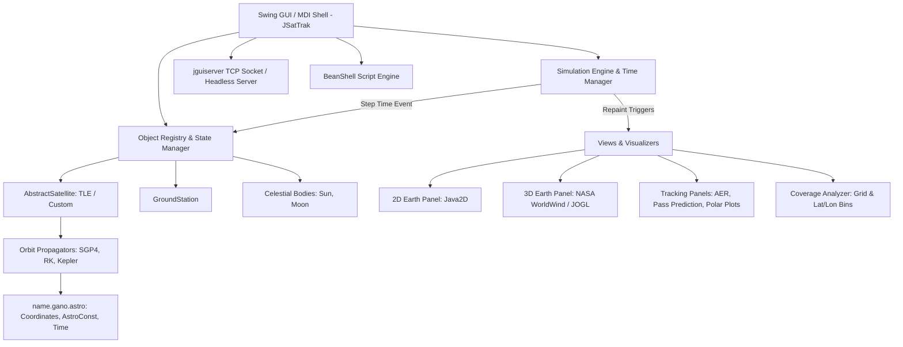
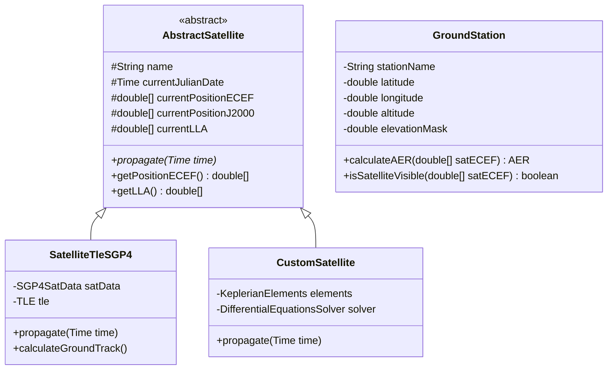
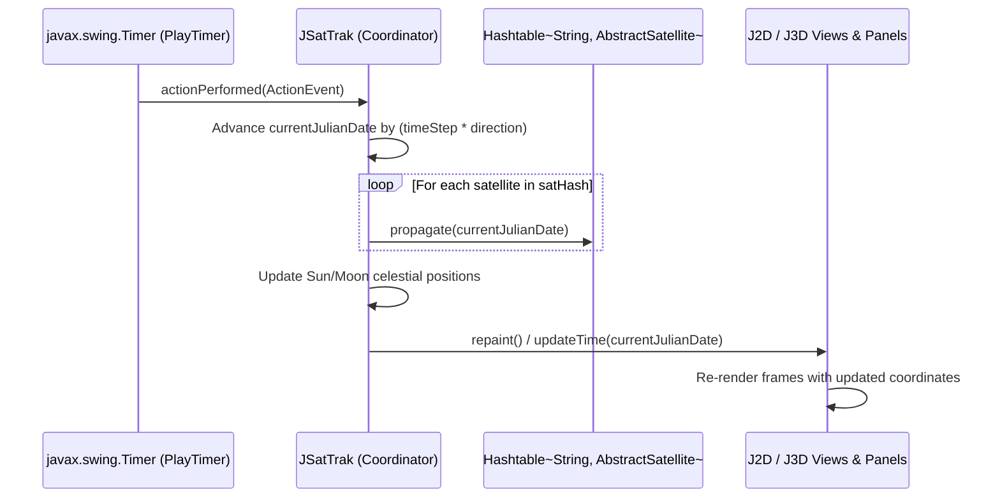

# JSatTrak Software Architecture Document

## 1. System Overview

**JSatTrak** is an open-source, Java-based astrodynamics and satellite tracking application. It provides real-time and simulated tracking of artificial satellites, 2D map projections, 3D interactive virtual globe visualizations, ground station pass predictions, sensor coverage analysis, and headless automation via scripting.

Key capabilities include:
- **Orbit Propagation**: Real-time and offline propagation via SGP4/SDP4 (CSSI implementation), Keplerian two-body, and numerical integrators (Runge-Kutta 4, 7-8, Adams-Bashforth-Moulton).
- **Coordinate Systems & Transformations**: Conversion across TEME (True Equator Mean Equinox), J2000 / ECI, ECEF (ITRF), topocentric AER (Azimuth, Elevation, Range), Geodetic (Lat, Lon, Alt).
- **Multi-View Visualization**:
  - 2D equirectangular cartographic view (Java2D / Swing) displaying satellite footprints, day/night terminators, ground tracks, and ground stations.
  - 3D interactive virtual globe rendering using NASA WorldWind Java (WWJ) and JOGL (OpenGL).
- **Analysis Tools**: Pass prediction for ground stations, radar/optical look angles, sensor coverage mapping, ephemeris export, and MP4 video generation.
- **Automation & Scripting**: Embedded BeanShell interpreter, socket/TCP remote control server (`jguiserver`), and headless execution support.

---

## 2. High-Level Architectural Style

JSatTrak adopts an **Event-Driven Desktop MDI (Multiple Document Interface) Architecture** centered around a primary coordinator frame ([`JSatTrak`](file:///Users/ffelix/Movistar%20Cloud/Workspaces/Java/JSatTrak/src/main/java/jsattrak/gui/JSatTrak.java)).



### Key Architectural Layers

1. **Presentation / MDI Layer (`jsattrak.gui`)**:
   - Manages desktop windows, internal frames, dockable side panels, toolbars, and time scrub controls.
   - Manages views: 2D maps ([`J2DEarthPanel`](file:///Users/ffelix/Movistar%20Cloud/Workspaces/Java/JSatTrak/src/main/java/jsattrak/gui/J2DEarthPanel.java)), 3D globes ([`J3DEarthPanel`](file:///Users/ffelix/Movistar%20Cloud/Workspaces/Java/JSatTrak/src/main/java/jsattrak/gui/J3DEarthPanel.java), [`J3DEarthInternalPanel`](file:///Users/ffelix/Movistar%20Cloud/Workspaces/Java/JSatTrak/src/main/java/jsattrak/gui/J3DEarthInternalPanel.java)), tracking readouts, and object browsers.
2. **Domain & Entity Layer (`jsattrak.objects`)**:
   - Represents physical domain entities: [`AbstractSatellite`](file:///Users/ffelix/Movistar%20Cloud/Workspaces/Java/JSatTrak/src/main/java/jsattrak/objects/AbstractSatellite.java), [`SatelliteTleSGP4`](file:///Users/ffelix/Movistar%20Cloud/Workspaces/Java/JSatTrak/src/main/java/jsattrak/objects/SatelliteTleSGP4.java), [`CustomSatellite`](file:///Users/ffelix/Movistar%20Cloud/Workspaces/Java/JSatTrak/src/main/java/jsattrak/objects/CustomSatellite.java), [`GroundStation`](file:///Users/ffelix/Movistar%20Cloud/Workspaces/Java/JSatTrak/src/main/java/jsattrak/objects/GroundStation.java).
3. **Astrodynamics Core Layer (`name.gano.astro`)**:
   - Self-contained scientific calculation library providing SGP4 propagation, numerical ODE solvers, coordinate reference frame conversions, Julian date math, and astronomical constants.
4. **Analysis & Auxiliary Engines**:
   - **Coverage Engine (`jsattrak.coverage`)**: Calculates ground point grid coverage, revisit rates, and creates thematic heat maps.
   - **Automation & Remote (`jguiserver`, `commandclient`, `org.beanshell`)**: Remote TCP command interface and BeanShell script execution for batch simulations.
   - **Persistence & Serialization (`jsattrak.utilities`, `XStream`)**: Saves and restores application workspace scenarios as XML (.jst).

---

## 3. Subsystem Breakdown

### 3.1 Astrodynamics & Orbit Propagation (`name.gano.astro`)

The astrodynamics package contains the core mathematical and physical models:

```
name.gano.astro/
├── AstroConst.java           # WGS84, Earth radius, GM, speed of light, J2/J3/J4 harmonics
├── JulianDay.java / Time.java # Julian dates, UTC, TT, sidereal time computations
├── Kepler.java               # Kepler's equation solvers, orbital elements to state vectors
├── GeoFunctions.java         # Lat/Lon/Alt geodetic transforms, footprint radius calculations
├── AER.java                  # Azimuth, Elevation, Range vector computations
├── coordinates/
│   ├── J2000.java            # Earth-Centered Inertial (ECI) coordinate representation
│   └── TEME.java             # True Equator Mean Equinox (TLE frame)
└── propogators/
    ├── sgp4_cssi/            # CSSI / Vallado SGP4 / SDP4 implementation
    │   ├── SGP4unit.java     # Near-space and deep-space analytic propagation
    │   ├── SGP4SatData.java  # SGP4 satellite operational state
    │   └── SGP4utils.java   # Two-Line Element (TLE) parsing and initialization
    └── solvers/              # Numerical integration for custom orbits
        ├── RungeKutta4.java
        ├── RungeKutta78.java
        └── AdamsBashforthMoulton.java
```

#### Coordinate Transformation Pipeline

For SGP4 satellites, positions are computed as follows:
1. **TLE Parsing**: SGP4 elements are parsed into [`SGP4SatData`](file:///Users/ffelix/Movistar%20Cloud/Workspaces/Java/JSatTrak/src/main/java/name/gano/astro/propogators/sgp4_cssi/SGP4SatData.java).
2. **TEME Propagation**: [`SGP4unit.sgp4`](file:///Users/ffelix/Movistar%20Cloud/Workspaces/Java/JSatTrak/src/main/java/name/gano/astro/propogators/sgp4_cssi/SGP4unit.java) computes position and velocity vectors $(r_{teme}, v_{teme})$ at simulation time $t$.
3. **TEME to ECI (J2000)**: Transformed using Greenwich Mean Sidereal Time (GMST) and precession/nutation adjustments.
4. **ECI to ECEF (Earth-Fixed)**: Rotated by Earth rotation angle for terrain mapping.
5. **ECEF to Geodetic**: Converted to Latitude, Longitude, and Altitude via WGS-84 ellipsoid parameters.
6. **Topocentric (AER)**: Projected relative to Ground Stations to calculate local Azimuth, Elevation, and Range.

---

### 3.2 Domain Objects (`jsattrak.objects`)



- [`AbstractSatellite`](file:///Users/ffelix/Movistar%20Cloud/Workspaces/Java/JSatTrak/src/main/java/jsattrak/objects/AbstractSatellite.java): Abstract base class ensuring a unified interface for orbit state queries, regardless of whether the orbit is generated by SGP4 TLEs or numerical equations of motion.
- [`SatelliteTleSGP4`](file:///Users/ffelix/Movistar%20Cloud/Workspaces/Java/JSatTrak/src/main/java/jsattrak/objects/SatelliteTleSGP4.java): The primary satellite representation used for NORAD/Celestrak catalog tracking.
- [`CustomSatellite`](file:///Users/ffelix/Movistar%20Cloud/Workspaces/Java/JSatTrak/src/main/java/jsattrak/objects/CustomSatellite.java): Allows defining user orbits via state vectors or classical Keplerian orbital elements, propagated numerically.
- [`GroundStation`](file:///Users/ffelix/Movistar%20Cloud/Workspaces/Java/JSatTrak/src/main/java/jsattrak/objects/GroundStation.java): Represents tracking stations, optical sites, or user observers. Performs line-of-sight checks and passes computation.

---

### 3.3 Visualization Architecture

#### 2D Cartographic Engine ([`J2DEarthPanel`](file:///Users/ffelix/Movistar%20Cloud/Workspaces/Java/JSatTrak/src/main/java/jsattrak/gui/J2DEarthPanel.java))
- Built on standard Java Swing / Java2D graphics.
- Rendered layers:
  1. Base map image (equirectangular Earth texture).
  2. Day/Night solar terminator curve (computed using sub-solar point from [`Sun`](file:///Users/ffelix/Movistar%20Cloud/Workspaces/Java/JSatTrak/src/main/java/name/gano/astro/bodies/Sun.java)).
  3. Ground tracks (past orbit trail, future lead orbit trail).
  4. Satellite sub-satellite points and sensor visibility cones (footprint circles).
  5. Ground station locations and horizon mask rings.
  6. Real-time mouse coordinate readout, distance measurement lines, and coverage heat overlays.

#### 3D Virtual Globe Engine ([`J3DEarthPanel`](file:///Users/ffelix/Movistar%20Cloud/Workspaces/Java/JSatTrak/src/main/java/jsattrak/gui/J3DEarthPanel.java) / NASA WorldWind)
- Uses NASA WorldWind Java (WWJ) SDK combined with JOGL (Java OpenGL) hardware acceleration.
- Custom renderable layers:
  - [`OrbitModelRenderable`](file:///Users/ffelix/Movistar%20Cloud/Workspaces/Java/JSatTrak/src/main/java/jsattrak/utilities/OrbitModelRenderable.java): Renders 3D orbital trajectory tubes and lines in ECI/ECEF coordinates.
  - [`ECEFModelRenderable`](file:///Users/ffelix/Movistar%20Cloud/Workspaces/Java/JSatTrak/src/main/java/jsattrak/utilities/ECEFModelRenderable.java): Renders 3D models or directional icons oriented in space.
  - Footprint cones, line-of-sight vectors between satellites and ground stations.

---

### 3.4 Simulation & Time Loop

The simulation loop is driven by [`JSatTrak`](file:///Users/ffelix/Movistar%20Cloud/Workspaces/Java/JSatTrak/src/main/java/jsattrak/gui/JSatTrak.java) using a Swing [`javax.swing.Timer`](file:///Users/ffelix/Movistar%20Cloud/Workspaces/Java/JSatTrak/src/main/java/jsattrak/gui/JSatTrak.java#L137):



Modes supported:
- **Real-Time Tracking**: Clock advances at $1\times$ real wall-clock time synced to system NTP time.
- **Fast Forward / Rewind**: Simulation step rate scaled by a time multiplier factor (e.g., $10\times, 60\times, 1000\times$).
- **Manual Stepping**: Precise single-step orbital delta for analysis.

---

### 3.5 Automation, Scripting & Remote Control

1. **BeanShell Scripting (`org.beanshell`)**:
   - JSatTrak embeds a BeanShell console (`desktop.bsh`).
   - Allows users to programmatically interact with internal application objects, run parameter variations, load TLE sets, and export ephemerides without modifying source code.
2. **Headless Execution (`noGUIscript.bsh`)**:
   - Capable of running batch propagations, coverage calculations, and image generation in headless/server environments without instantiating the Swing GUI.
3. **TCP GUI Server (`jguiserver.GuiServer` & `commandclient`)**:
   - Provides a socket-based network interface listening for external commands (e.g. adding satellites, commanding camera angles, triggering passes computation).

---

### 3.6 Data Storage & Persistence

- **TLE Catalog Data (`data/tle/`)**: Local catalog files downloaded from CelesTrak or loaded manually by users.
- **Scenario Persistence (`jsattrak.utilities.JstSaveClass`)**:
  - Saves the entire simulation scenario state into XML (`.jst` format) using [XStream](http://x-stream.github.io/).
  - Preserves loaded satellites, ground stations, view configurations (camera angles, open windows, grid options), and animation settings.

---

## 4. Key Dependencies & Build System

The project is built and managed via Maven (`pom.xml`):

| Dependency | Purpose | Details |
|---|---|---|
| **Java SE 8** | Runtime / Language Target | Configured in `maven-compiler-plugin` |
| **NASA WorldWind (0.6.0)** | 3D Globe Rendering | High-performance virtual globe GIS |
| **JOGL (1.1.1) / GlueGen (1.0b06)** | OpenGL Bindings | Java-to-native OpenGL bindings for WWJ |
| **FlatLaf (3.5.4)** | User Interface Look and Feel | Modern cross-platform Swing UI |
| **Jama (1.0.2)** | Linear Algebra Matrix Math | Matrix decompositions and coordinate vectors |
| **JCodec (0.2.5)** | Video Rendering | Pure-Java MP4 video export |
| **XStream (1.3) & XPP3 (1.1.4c)** | XML Serialization | Saving and loading `.jst` project files |
| **BeanShell (2.0b4-seg)** | Dynamic Scripting | Embedded Java syntax interpreter |
